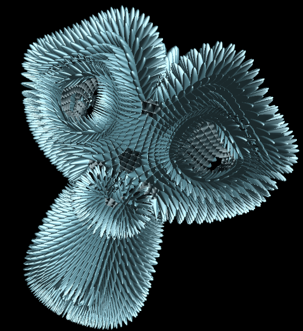
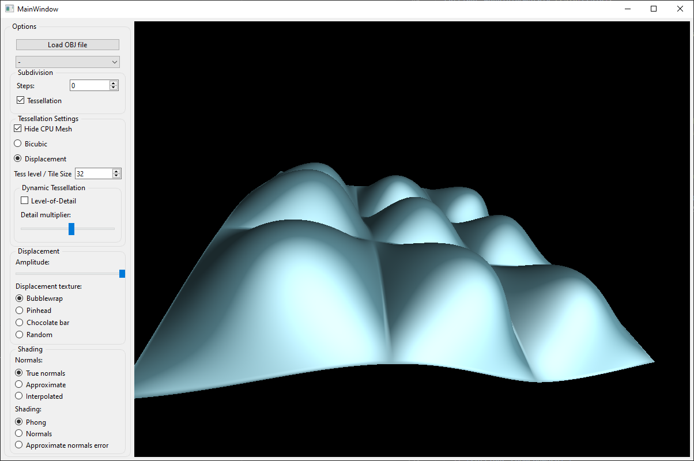
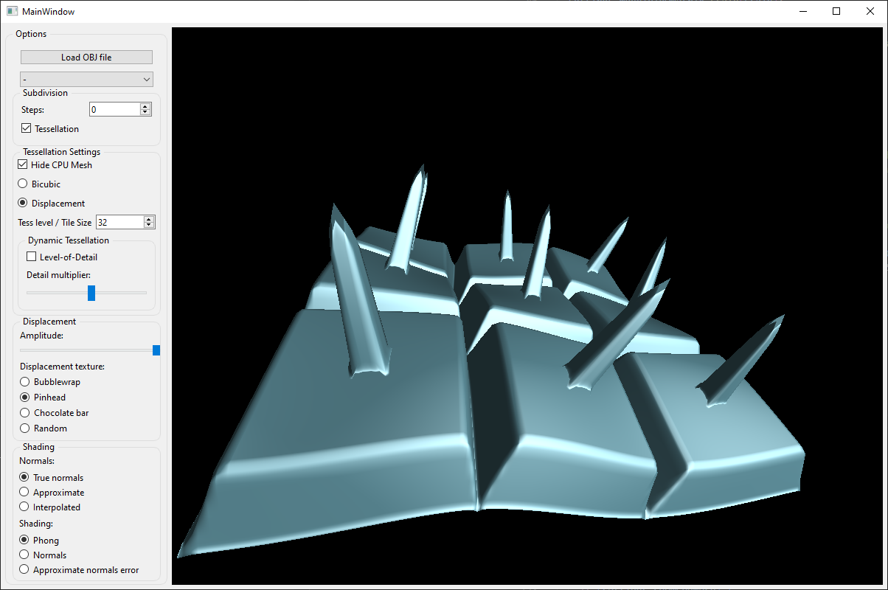
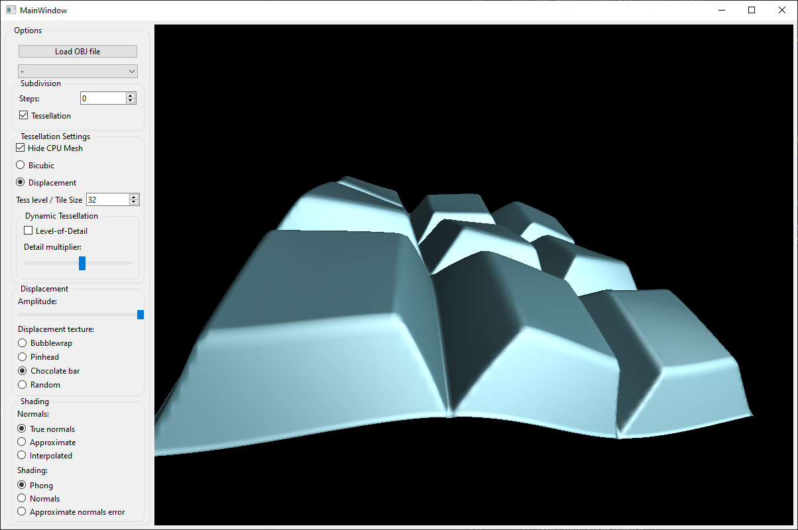
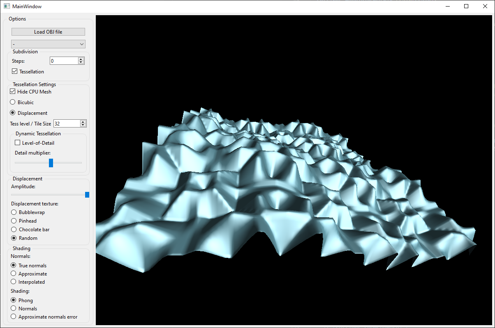
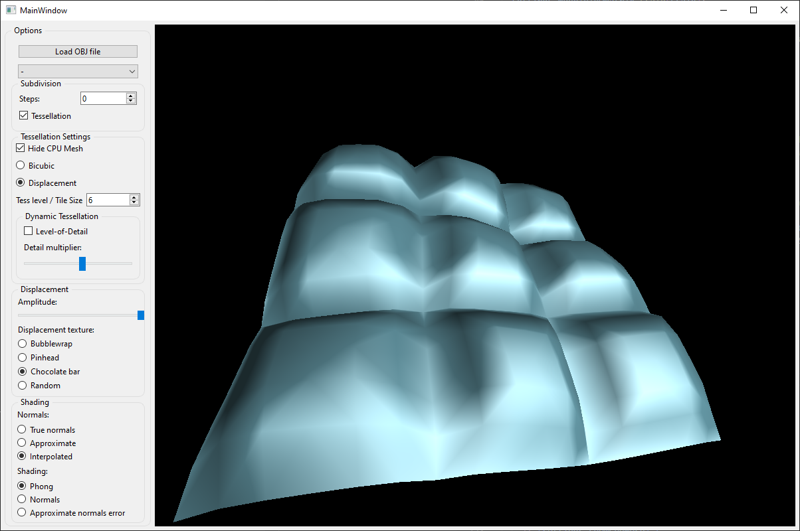
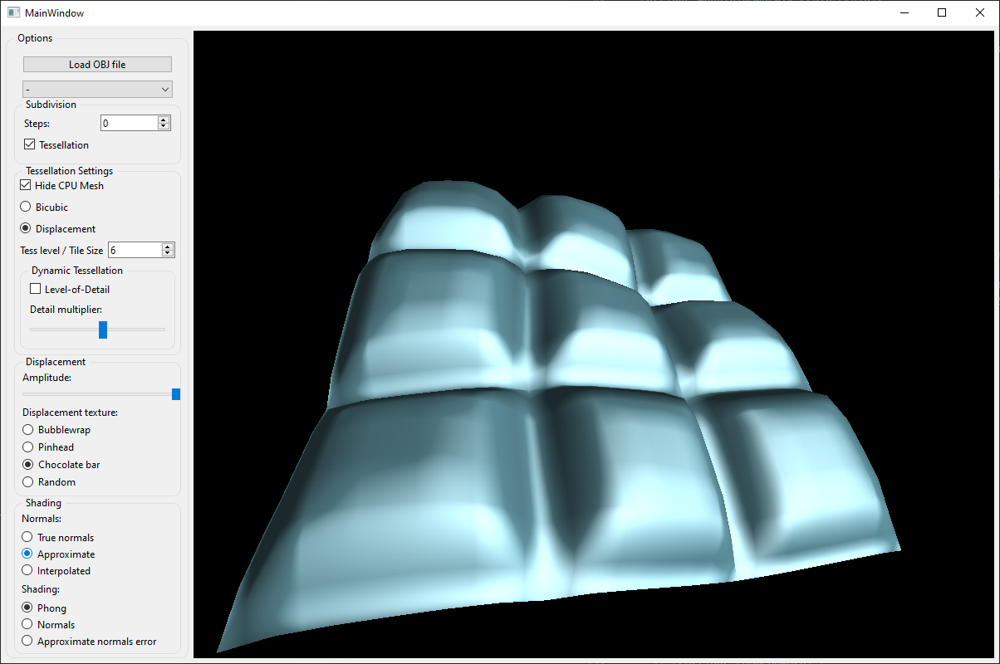
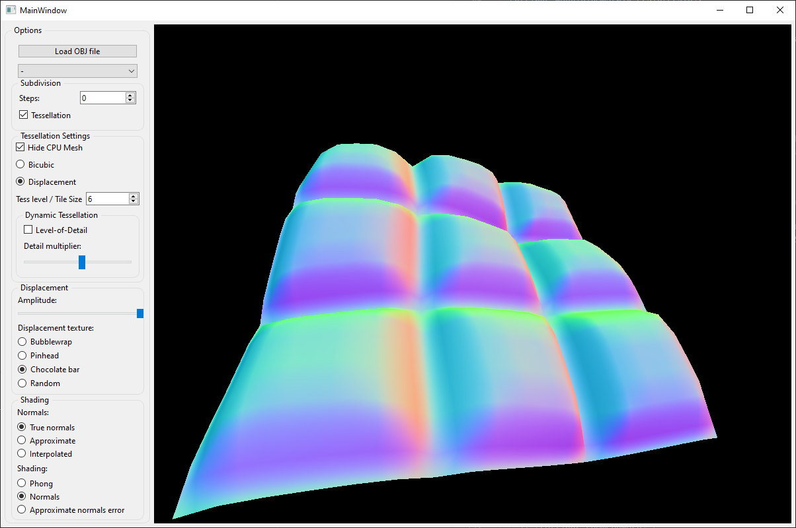
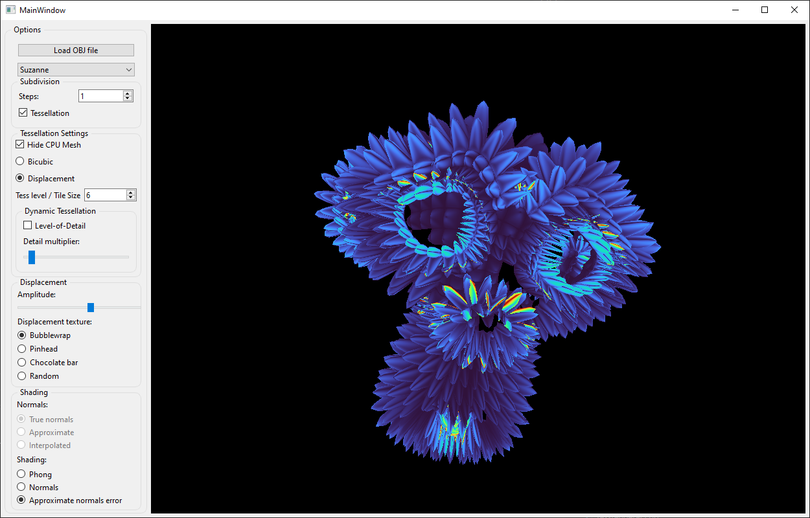

# Analytical-Displacement-Mapping
### Implementation of analytical displacement mapping using hardware tessellation based on [Nießner & Loop (2013)](https://dl.acm.org/doi/10.1145/2487228.2487234)

## Code
The components of the application related to analytical displacement mapping:
- [tessrenderer.cpp](source/renderers/tessrenderer.cpp) - The main renderer class for tessellation
- [procedural.glsl](source/shaders/procedural.glsl) - Procedural generation of displacement coefficients
- [displace.vert](source/shaders/displace.vert) - *Vertex Shader* for displacement mapping
- [displace.tesc](source/shaders/displace.tesc) - *Tessellation Control Shader* for displacement mapping
- [displace.tese](source/shaders/displace.tese) - *Tessellation Evaluation Shader* for displacement mapping
- [displace.frag](source/shaders/displace.frag) - *Fragment Shader* for displacement mapping

## Overview of main features

### Procedural textures:
- Bubblewrap

- Pinhead

- Chocolate bar

- Random

### Normal types:
- Interpolated normals

- Approximate normals

- True normals

### Shading:
- Phong shading (see examples above)
- Normal shading (Visualization for all types of normals)

- Approximation Error (Error of approximate errors compared to true normals)
